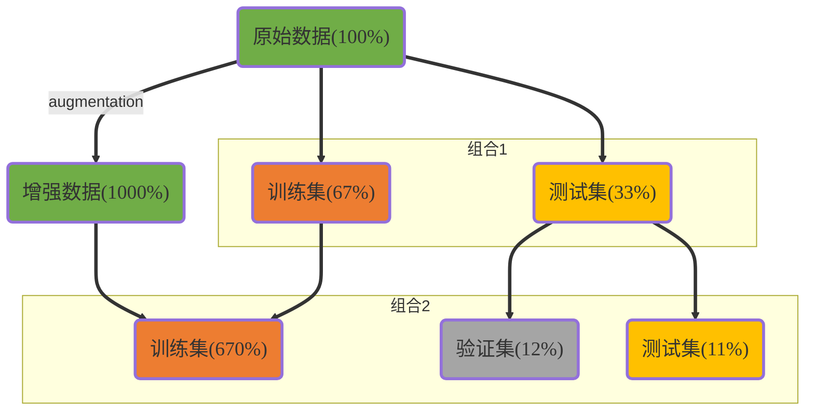

的方法

的方法的方法的方法的方撒旦撒旦法

```mermaid
graph TB
    orig("原始数据(100%)")
    agmt("增强数据(1000%)")
    train1("训练集(67%)")
    train2("训练集(670%)")
    test1("测试集(33%)")
    vld("验证集(12%)")
    test2("测试集(11%)")
    orig==augmentation==>agmt
    orig==>train1
    train1==>train2
    agmt==>train2
    orig==>test1
    test1==>vld
    test1==>test2


    subgraph 组合1
        train1
        test1
        end
    subgraph 组合2
        train2
        vld
        test2
    end

    classDef blue fill:#4472C4,stroke-width:3px,font-family:Microsoft YaHei UI,font-size:20px;
    classDef orange fill:#ED7D31,stroke-width:3px,font-family:Microsoft YaHei UI,font-size:20px;
    classDef yellow fill:#FFC000,stroke-width:3px,font-family:Microsoft YaHei UI,font-size:20px;
    classDef gray fill:#A5A5A5,stroke-width:3px,font-family:Microsoft YaHei UI,font-size:20px;
    classDef green fill:#70AD47,stroke-width:3px,font-family:Microsoft YaHei UI,font-size:20px;
    class orig,agmt green;
    class train1,train2 orange;
    class test1,test2 yellow;
    class vld gray;
```

gfdgd

